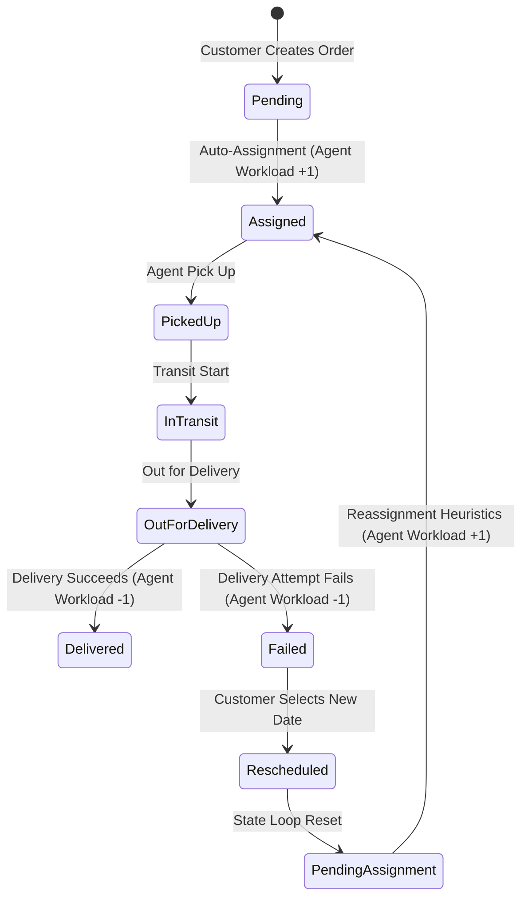

# System Design Write-Up

This document details the system design, algorithms, and logical workflows of the Last-Mile Delivery Tracker core engine.

---

## 1. Rate Calculation Engine

The Rate Calculation Engine calculates package delivery costs dynamically from configurations stored in MongoDB. The calculation avoids hardcoding parameters to enable real-time price updates by administrators.

### Mathematical Pricing Formula
The final charge is calculated as:
$$\text{Delivery Charge} = \text{baseRate} + \max(0, \text{billableWeight} - \text{baseWeight}) \times \text{perKgRate} + \text{surcharge}$$

Where the parameters are resolved as follows:
1.  **Volumetric Weight Calculation:** The package dimensions are checked to evaluate density displacement:
    $$\text{Volumetric Weight (kg)} = \frac{\text{Length} \times \text{Breadth} \times \text{Height} \text{ (cm)}}{5000}$$
2.  **Billable Weight Selection:** The system selects the greater value between physical weight and volumetric weight to charge for actual space consumed:
    $$\text{Billable Weight} = \max(\text{Actual Weight}, \text{Volumetric Weight})$$
3.  **Rate Card Resolution:** Looks up the `RateCard` collection matching the specific `orderType` (`B2B` or `B2C`) and the evaluated `zoneType` (`intra-zone` or `inter-zone`).
4.  **Surcharge Assessment:** If the payment type is Cash on Delivery (`COD`), the `codSurcharge` parameter defined on the selected RateCard is added to the final charge.

---

## 2. Zone Detection Heuristics

The system resolves geographic locations to administrative zones using standard Mongoose queries:
1.  **Address Parsing:** Orders contain subdocuments for `pickupAddress` and `dropAddress`. The system extracts the corresponding numeric strings for pickup and drop pincodes.
2.  **Zone Resolution:** Queries the `Zone` collection to find which document covers the given pincodes:
    ```javascript
    const resolvedZone = await Zone.findOne({ pincodes: targetPincode });
    ```
    If either pincode is not found in any zone document, the transaction throws a `400 Bad Request` ("Service unavailable: pincode not covered by any zone").
3.  **Relation Classification:**
    *   If both pickup and drop zones resolve to the **same** Zone ID, the shipment is classified as **`intra-zone`**.
    *   If they resolve to **different** Zone IDs, the shipment is classified as **`inter-zone`**.

---

## 3. Nearest-Agent Auto-Assignment

When an order reaches `Pending Assignment`, the `AutoAssignmentService` uses a distance-constrained heuristic to select the best agent:
1.  **Filtering Candidates:** Finds active agents who are:
    *   Currently logged in as delivery agents (`role: 'agent'`).
    *   Marked as available (`agentMetadata.isAvailable: true`).
    *   Assigned to the pickup zone of the shipment (`agentMetadata.currentZone` matches `pickupZone`).
    *   Workload constrained: Mapped order counts must be under the workload ceiling (`agentMetadata.activeOrderCount < 3`).
2.  **Haversine Distance Heuristic:** Calculates the distance between the pickup coordinates and the agent's current location using the Haversine formula:
    $$d = 2R \arcsin \left( \sqrt{\sin^2\left(\frac{\Delta \text{lat}}{2}\right) + \cos(\text{lat}_1)\cos(\text{lat}_2)\sin^2\left(\frac{\Delta \text{lon}}{2}\right)} \right)$$
    Where $R$ is the Earth's radius ($6371$ km).
3.  **Selection & Workload Update:** The agent with the smallest Haversine distance is selected. The order status updates to `Assigned`, the agent reference is updated, and the agent's `activeOrderCount` is incremented by `1`.

---

## 4. Failed-Delivery Handling & Rescheduling

The system handles package delivery failures and customer rescheduling through a state-controlled transition loop to ensure data integrity and accurate agent workloads:



1.  **Workload Release on Failure:** When an agent logs a delivery attempt as `Failed`, the system releases the agent from the active shipment:
    *   The order transitions to `Failed`.
    *   The agent's `activeOrderCount` is decremented by `1`.
    *   A subdocument is pushed to the order's `attempts` array, recording the attempt number, timestamp, agent details, and remarks.
2.  **Customer Rescheduling Loop:**
    *   Only orders in `Failed` status can be rescheduled.
    *   The customer selects a rescheduled date, which is recorded on the last failed attempt subdocument.
    *   The order transitions `Failed → Rescheduled → Pending Assignment`.
    *   `AutoAssignmentService` is triggered immediately, calculating the nearest available agent to assign the order back to `Assigned` status (re-incrementing the assigned agent's workload).
